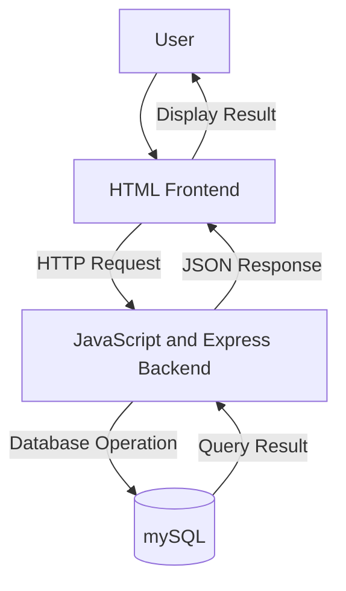

# System Architectural Design
## 1. System Overview
The Student Task Management System is a web-based application designed to help students organize and manage their academic tasks, such as assignments, projects, quizzes, and deadlines. It provides a centralized platform where students can view, track, and update their tasks, while teachers can assign activities and monitor student progress. The primary purpose of the system is to improve time management, reduce missed deadlines, and enhance productivity by making academic task management more efficient and organized.
## 2. Selected Architectural Pattern
The proposed system will use a three-tier client-server architecture.
The system will be divided into:
1. Presentation layer
2. Application layer
3. Data layer
This architecture separates the user interface, business logic, and data
management responsibilities.
## 3. Architectural Components
### Presentation Layer
The presentation layer will use HTML It will display information,
collect user input, and send requests to the backend.
### Application Layer
The application layer will use JavaScript and Express. It will receive
requests, validate data, apply system rules, and communicate with the
database.
### Data Layer
The data layer will use mySQL. It will store, retrieve,
update, and delete the system's records.
## 4. Component Responsibilities
| Component | Technology | Responsibility |
|---|---|---|
| User interface | HTML | Displays data and collects user input |
| Application server | JavaScript and Express | Processes requests and applies business rules |
| Database | mySql | Stores and manages system records |
| Repository | GitHub | Stores documentation and tracks changes |
## 5. System Architecture Diagram

## 6. Data Flow
### Example Process: Create a New Record
1. The **Student** logs into the Student Task Management System.
2. The student navigates to the **Add Task** page and enters the task details, such as the task title, description, subject, due date, and priority.
3. When the student clicks the **Save** button, the **HTML frontend** collects the input and sends it to the **JavaScript backend** for processing.
4. The JavaScript backend validates the submitted data to ensure all required fields are completed and that the information is in the correct format.
5. If the data is valid, the backend sends an SQL query to the **MySQL database** to create a new task record.
6. The MySQL database stores the new task information in the **Tasks** table and returns a success response to the backend.
7. The JavaScript backend sends the result back to the frontend.
8. The HTML frontend displays a confirmation message (e.g., **"Task created successfully."**) and updates the task list to include the newly created task.
9. The student can now view, edit, or mark the newly created task as completed from the dashboard.

## 7. Database Plan

### Proposed Database Name

```text
chcc_student_information_db
```

### Primary Collection

```text
tasks
```

### Proposed Fields

| Field       | Type     | Description                                           |
| ----------- | -------- | ----------------------------------------------------- |
| _id         | ObjectId | Unique task identifier                                |
| title       | String   | Title of the task                                     |
| description | String   | Details about the task                                |
| subject     | String   | Subject or course associated with the task            |
| dueDate     | Date     | Deadline for the task                                 |
| status      | String   | Current task status (Pending, In Progress, Completed) |
| priority    | String   | Priority level (Low, Medium, High)                    |
| studentId   | ObjectId | Reference to the student assigned to the task         |
| createdAt   | Date     | Date and time the task was created                    |
| updatedAt   | Date     | Date and time the task was last updated               |

---

## 8. Design Justification

A three-tier architecture is appropriate for the proposed Student Information System for CHCC because it separates the system into the presentation layer (frontend), application layer (backend), and data layer (database). This separation makes the system easier to maintain, develop, and expand.

The frontend provides an intuitive interface where students can create, manage, and monitor their academic tasks. The backend processes business logic such as validating task information, updating task status, managing reminders, and handling requests from the user interface. The database securely stores task records and related student information.

This architecture improves maintainability because changes to the user interface can be made without affecting the backend or database. Security is enhanced since users interact only with the backend, which validates requests before accessing the database. Testing is also simplified because each layer can be tested independently. In addition, the system is easier to scale and enhance in the future by adding features such as user authentication, notifications, reporting, analytics, and integration with other school services without requiring major changes to the overall architecture.

---

## 9. Architectural Limitations

The current activity focuses only on the proposed three-tier architecture of the Student Information System for CHCC. At this stage, the project serves as a design plan and does not include implementation. The frontend user interface, backend application logic, database connectivity, user authentication, notification services, and system deployment have not yet been developed. These components will be implemented and integrated during Module 7 to produce a fully functional system.

This version is ready to paste into your `README.md` or `docs/architecture.md`. If your instructor expects a broader **Student Information System** (including students, grades, attendance, and enrollment) rather than a task-management module, I can also adjust the database plan to match that scope.
